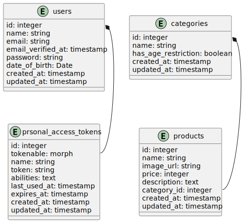

# Userlution assingment

## Instruction to run the application

To run the application, make sure you have a fresh clone of the application and docker installed.

the following command runs the application:

```
./config_and_run.sh
```

the command above will build all the containers (of course docker will build them :D), runs them, and executes database migrations and seed.

> Note than the docker compose file is configured to map the port 80 of router proxy to port 80 of your machine, if your port 80 is already occupide you may change it by visiting docker-compose.yml at line 21 and change it like the following:
>
> ` - '8000:80'`
>
> the above port mapping indicates that port 80 of the `router` service will map to port 8000 of the host machine.

you may use the following users:

| email | password | age |
| --- | --- | --- |
| user@example.com | 123456 | 32 |
| granduser@example.com | 123456 | 80 |
| freebird@example.com | 123456 | 20 |
| kiddo@example.com | 123456 | 5 |
| 11@example.com | 123456 | 11 |

## Problem statement

**Solve this coding challenge:**

Please built two types of pages based on Laravel with the following requirements. It doesn’t need to be pretty but don’t use templates. 
You can focus on backend or frontend, but you need to do both.

* Page with product list
* Pages for each individual product
* Products of one category should be visible for user of a age range of 18-30 only

Acceptance criteria:

* Users (at least 20, doesn’t require a page)
* Products (at least 5)
* Product categories (at least 5, doesn’t require a page)

Add as many feature as you like e.g. sorting, filtering. The goal is to see your approach to the
challenge and your coding style.

## Solution

The solution consists of two main parts, a frontend application implemented in ReactJS and a backend application written in php/Laravel.

That said, the application is fully dockerized as per the diagram below:


### backend

The structure fo the backend is very simple. I decided to use single action pattern for our backend, therefore we have a layer of controllers in which are just responsible to make sure the action is authorized.

#### Api doc

before talking about any architechture, let's talk about documentation, you may find the api documentation of the application [here at docs/openapi-doc.yml](docs/openapi-doc.yml) in form of openapi v3.

#### single actions and service layer

> Note that thanks to laravel model binding, making sure if the products are found are handled by latavel route model binding, therefore if for example a user calls, `api/product/1000` and such a product doesn't exist in our database, laravel route model binding automatically throws a 404. On the other hand, if such a product (entity) exists in our database, it will automatically translates queries for it and translates it to an object.
>
> There are several concerns (pros and cons) to this approach but for our current tiny little application it's all benefits :)

The Controllers are wired up using the intenrnal laravel dependency injection (hereinafter DI) engine with actions. So every API call truns into calling an action.

Reponsibility of Actions are to just handle the instuctions and keep the recepie, therefore what they do is they call Services. Services aare responsible for performing smallest intractions (as per single responsibility princible) to fulfill their purpose of life. Therefore service layer is the layer to intract directly with data (using Models of course) and performing queries.

#### Authentication

for authentication, since the eniter application is run on the same origin (Thanks to docker and proxy router), I decided to go with stateful APIs and store the token as a httponly cookie, therefore we can be a bit more releaved regarding security concerns and token handleing in the frontend application.

> Note that in one place I paddled a bit against what I said about Single Action pattern, and that's on the authentication using sanctum, as the controller is handleding the entire logic, my reasoning behind that is the focus of current application is not authencitcation but the actual operations over the data. That said, as this part of code is very straight forward you may not find it thoroguhly tested using Integration tests.

There is a nuance here and that's where I introduced a middleware (backend/app/Http/Middleware/TransformApiHeaders.php). As you might already know, `axios` will automatcially check if `XSRF-TOKEN` is set on the browser, and it just translates it to `X-XSRF-TOKEN` and puts it into the header. This will put a burdon on frontend side with what is not the philosophy of existance of a frontend application, And laravel doesn't bother to check for that token, instead it checks for the header with value of `X-XSRF-TOKEN` and performs a check against it.

> Whether its a good or a bad practice is very subjective but since the community is already using it, it should be fine i guess :D.

#### Authorization

Authroziation on the current application is also done using laravel policies, so it checks if the user is authorized to access the given product on single product API call.

### Tests

the main functionality of the application comes with a good amount of scenario coverate, I decided to go closer to Ditroit school of thoughts in testing, so I avodied mocking as much as possible and embraced TDD.


#### Runing tests

Although it's a good practice to go full TDD, I just went TDD for the main requested functionalities and only on APIs. So anyways to run tests, first make sure the application is up and running (at least the `database` and `backend` services should be up and running), and run the following command:

```
docker-compose exec -it backend php artisan migrate:fresh
docker-compose exec -it backend php artisan test
docker-compose exec -it backend php artisan db:seed
```

> Note that the tests would assume the database is empty, therefore the first command `docker-compose exec -it backend php artisan migrate:fresh` is necessary. also after running tests you mostlikely want to use the application again so the last command makes sure you get some data back in the database.

### database

The database structure is shown in the following Entity relationship diagram:



### Frontend

The frontend application is a simple react application with two extra packages:

* react-hook-form
* react-router

Probably using `react-hook-form` for just a login form is a over kill, but the implmentation pain was almost the same as not having it and handle the entire thing with native react hooks, so I decided to go for it.

And react router as the package is very famous doesn't need to be explained.

> I could chunk down the components even further but given that it's a test assingment, and no components could be resued, I just implmented everything in a couple of small pages.
>
> on the otherhand I could go with styled components for the CSS managmenet but again this was just a tiny app :)
